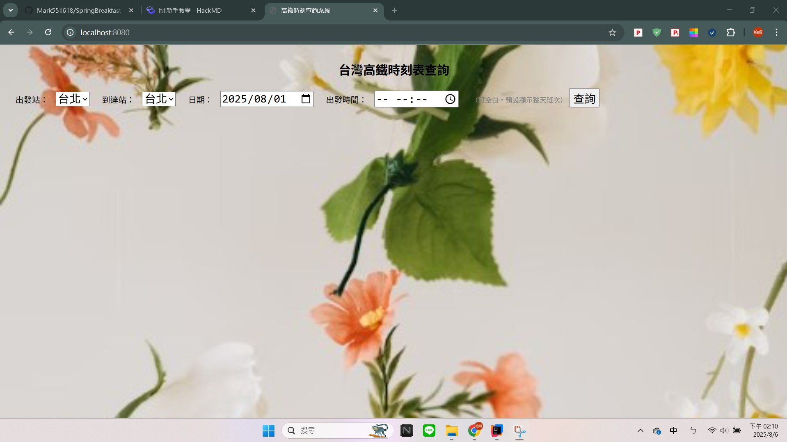
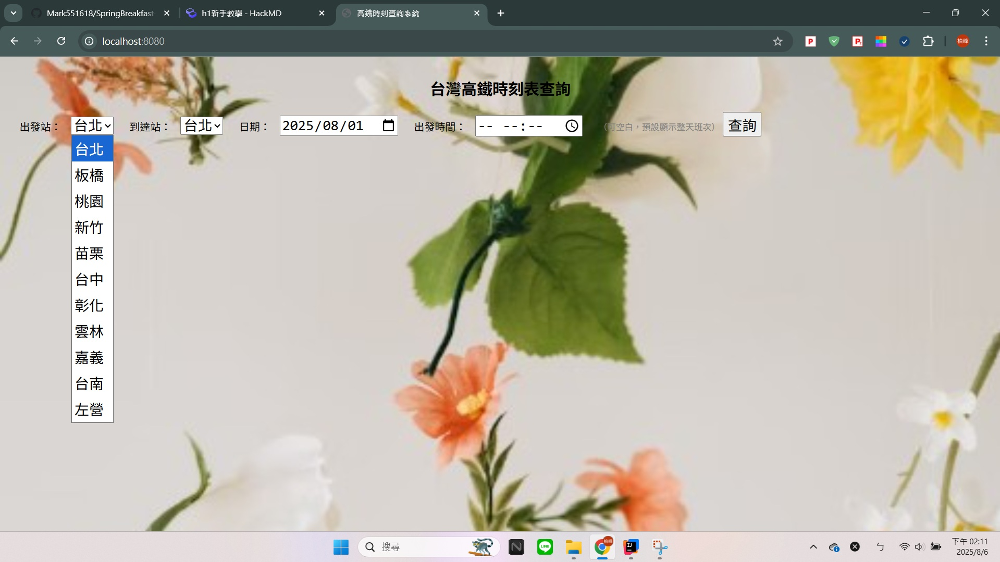
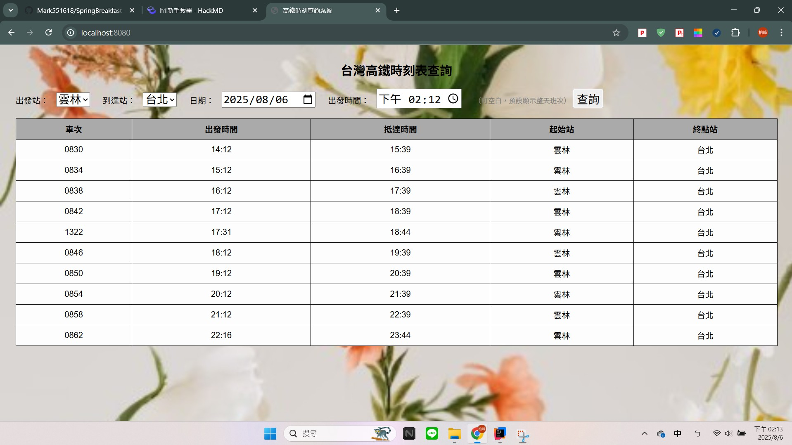

# \# SpringBoot 高鐵時間查詢系統

===

第一個圖片為高鐵時間查詢介面，還沒點選任何站之前的樣子。

&nbsp;	

 

第二個圖片為選擇起程站與抵達站可以使用下拉選單做選擇。

 	

 

第三個圖片為選擇好起程站、抵達站、日期以及時間

 	

 

第四個圖片為按下查詢之後，可以查詢到目前輸入的時間為下午2:12分，可以查詢到目前有哪些班次可以搭乘。

 	

 

